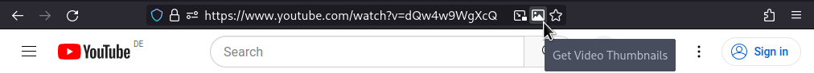

# Show YouTube Thumbnails

A small extension to quickly fetch the thumbnails of YouTube videos.

When on a YouTube video page, a button will be shown in the browsers address
bar. You can view the video's thumbnails by clicking the button.

## Acknowledgments

Thanks to this [Stack Overflow answer](https://stackoverflow.com/a/2068371) for
providing the thumbnail URLs. I've re-searched this answer time and time again
until finally codifying the logic into this extension.

Thanks to [Font Awesome by Dave Gandy](http://fontawesome.io) for the extension icon.
